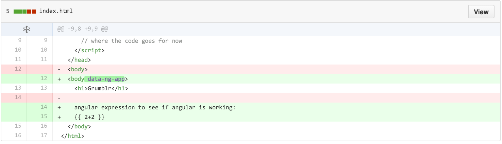
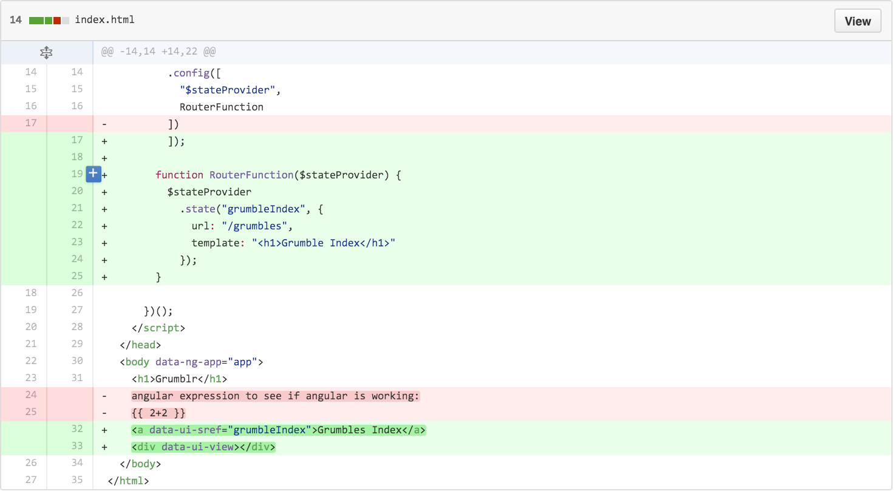
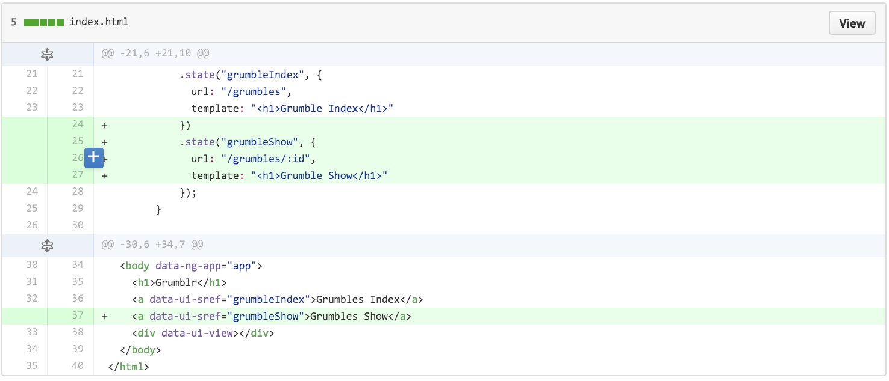
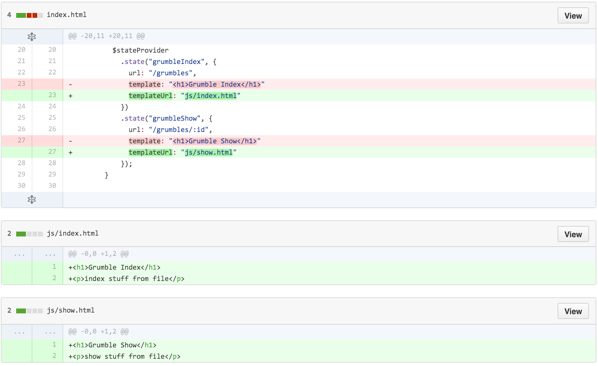
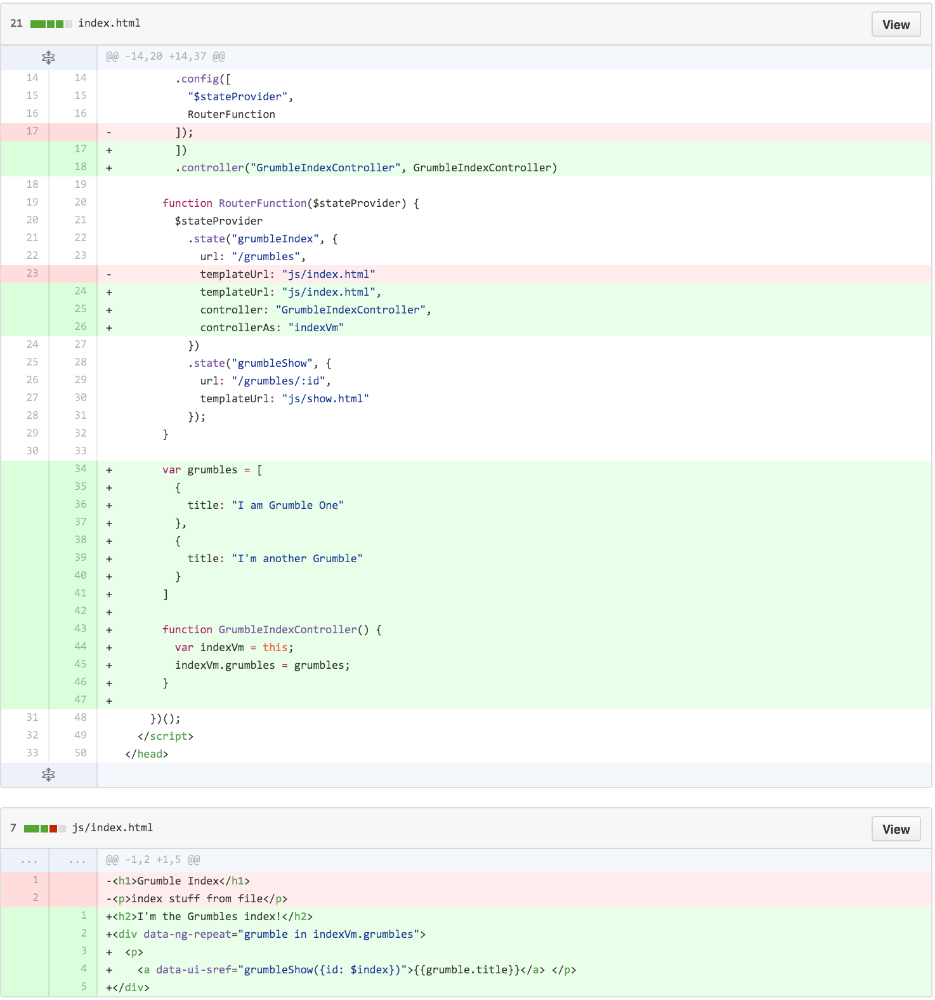
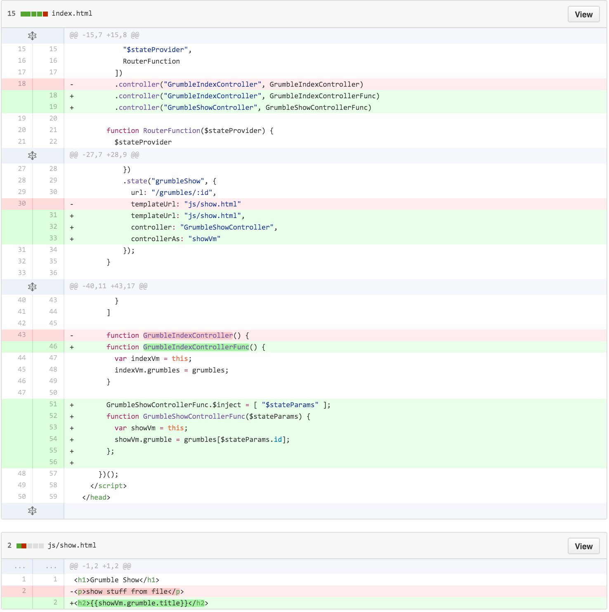
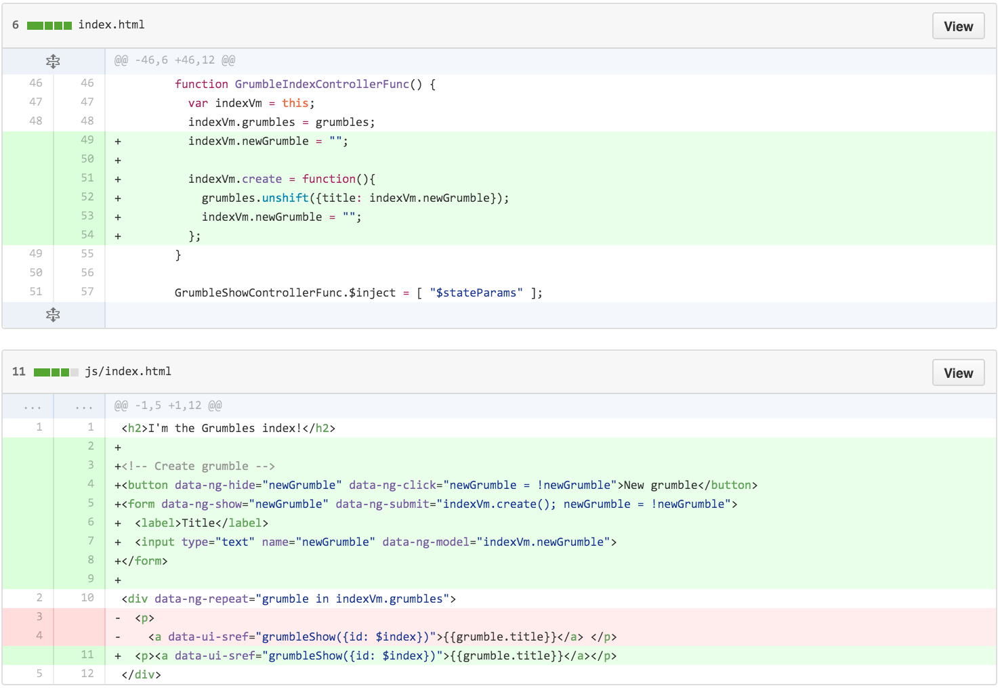
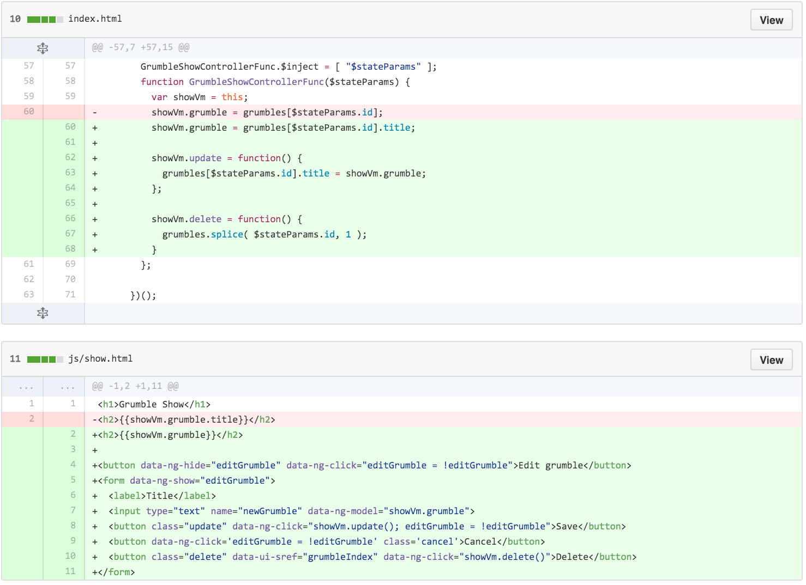

# Angular and $uiRouter

### Screencasts

- Dec 15, 2015, (Robin)
  - [Part 1](https://youtu.be/FurQ9FGzJwk)
  - [Part 2](https://youtu.be/CtV0ULLlLf0)

### Learning Objectives

- Explain the purpose of templates in Angular
- Use the `ui-view` directive to load angular templates
- Use `$stateProvider` and `$state` to access query parameters and update the URL
- Define multiple controllers in a single module

### Framing (15 / 15)

So far we've been learning about Angular and its awesome power as front-end framework that allows us to easily build Single Page Apps.  

**Q**: What are some of the characteristics of SPAs?

> Single Page Applications are Web apps that load a single HTML page and dynamically update that page as the user interacts with the app. SPAs use AJAX and HTML5 to create fluid and responsive web apps, without constant page reloads.

### Turn and Talk: Problems with SPA's

Take 1 minute to brainstorm any potential problems with SPAs. Then take another minute coming up with a short list with your neighbor; we'll go around and share with the class.

---

### [Common Problems with SPA's](https://github.com/ga-wdi-lessons/angular-routing/blob/master/common-problems-with-spas.md)

Many of the common problems with SPAs have to do with the question of how to manage an application's state. This is most evident with issues related to **bookmarking** and **deep linking**.

# Application State

### Real world example: Trello

In order to get a better grasp of what we mean by an app's state, let take a look at a prolific SPA in the wild, [Trello](https://trello.com/).

Trello is a productivity management tool, that allows a user to have many different "boards", or a list of lists, and each board is made up of different "cards", or items in a list.

Let's play around with a board, and see what happens to the url when we interact with the app.

- **Note** - Changes to the url by default do not alter the app state. Developers had to explicitly connect the 'application state' to the url, so that when things in the app change the changes are reflected in the url.

### [UI Router](https://github.com/angular-ui/ui-router) to the Rescue

Today, we are going to be looking at one wildly popular solution in Angular to help address the problems we've uncovered with SPAs.

Specifically, Angular UI-Router is a client-side SPA routing framework that updates the browser's URL as the user navigates through the app.

As a result, this allows changes to the browser's URL to drive navigation through the app, thus allowing the user to create a bookmark to a location deep within the SPA.

- 'state' of angular app - application state
- state in ui-router

# Code Walkthrough

### Setup


CDN's
- Loading angular
- Loading angular-ui-router
- Loading angular-resource (will be used in the resource lesson)
- Code in a script tag
  - Putting our code in a script tag is a bad practice but it allows us an easier glimpse at what's going on


```js
<script src="https://ajax.googleapis.com/ajax/libs/angularjs/1.3.15/angular.min.js"></script>
<script src="https://cdnjs.cloudflare.com/ajax/libs/angular-ui-router/0.2.15/angular-ui-router.min.js"></script>
<script src="https://cdnjs.cloudflare.com/ajax/libs/angular.js/1.5.0-beta.2/angular-resource.min.js"></script>
<script>
  // where the code goes for now
</script>
```

### Check if angular is working



- What happened to the code within `{{ }}`?
- Test putting in something different to `{{ }}`? What do you notice?
- Test removing `ng-app`. What is `ng-app` doing?
- ng-app
  - [docs](https://docs.angularjs.org/api/ng/directive/ngApp)

---

#### STOP

---

### Add ui-router module and config


- `.module`
  - [docs](https://docs.angularjs.org/guide/module)
- `"ui.router"`
  - [stackoverflow answer](http://stackoverflow.com/a/21024270/5472034)
- `config`
  - Only **providers** and **constants** can be injected into configuration blocks. This is to prevent accidental instantiation of services before they have been fully configured.
- `$stateProvider`
  - [docs](https://github.com/angular-ui/ui-router/wiki/Quick-Reference#stateprovider-1)

### Add RouterFunction


---

- `.state` [docs](https://github.com/angular-ui/ui-router/wiki/Quick-Reference#stateproviderstatestatename-stateconfig)
  - url
  - template
- `ui-sref`
  - [docs](https://github.com/angular-ui/ui-router/wiki/Quick-Reference#ui-sref)
- `ui-view`
  - [docs](https://github.com/angular-ui/ui-router/wiki/Quick-Reference#ui-view)

#### STOP

---

### Add second state for show page


---

#### STOP

---

### Convert from template to templateUrl, add template files


- template vs templateUrl
  - Best Practice: Unless your template is very small, it's typically better to break it apart into its own HTML file and load it with the templateUrl option.

---

#### STOP

---

### Add data and controller


- controller
  - [docs](https://docs.angularjs.org/guide/controller)
  - controller scope [docs](https://docs.angularjs.org/guide/controller#scope-inheritance-example)
- controllerAs
  - [style guide](https://github.com/johnpapa/angular-styleguide/blob/master/a1/README.md#controlleras-controller-syntax)
- ng-repeat
  - [docs](https://docs.angularjs.org/api/ng/directive/ngRepeat)
  - $index


---

#### STOP

---

### Add show controller and update corresponding template


- dependency-injection
  - [docs](https://docs.angularjs.org/guide/di)
  - [style-guide](https://github.com/johnpapa/angular-styleguide/blob/master/a1/README.md#manually-identify-dependencies)
- $stateParams
  - [docs](https://github.com/angular-ui/ui-router/wiki/URL-Routing#stateparams-service)

---

#### STOP

---

### Add create to index controller & template


- ng-model
  - [docs](https://docs.angularjs.org/api/ng/directive/ngModel)
- ng-show
  - [docs](https://docs.angularjs.org/api/ng/directive/ngShow)
- ng-hide
  - [docs](https://docs.angularjs.org/api/ng/directive/ngHide)
- ng-click
  - [docs](https://docs.angularjs.org/api/ng/directive/ngClick)
  - [deprecation notice](https://docs.angularjs.org/api/ngTouch/directive/ngClick)
- ng-submit
  - [docs](https://docs.angularjs.org/api/ng/directive/ngSubmit)

---

#### STOP

---

### Add update and delete feats on controller & template


A completed version of this Walkthrough is available at https://github.com/ga-wdi-exercises/grumblr_angular/tree/ui-router-solution-onefile

### $locationProvider

You've probably never seen an Angular app that has hashmarks in its URLs the way we have here. That's because they're ugly and Angular makes them super-easy to remove.

First, inject `$locationProvder` into your router. Then, add `$locationProvider.html5Mode(true)`. The result should be:

```js
// ...
  .config([
    "$stateProvider",
    "$locationProvider",
    RouterFunction
  ]);

  function RouterFunction($stateProvider, $locationProvider){
    $locationProvider.html5Mode(true);
// ...
```

If you refresh the page now and follow the error link, it'll tell you that `$location` needs a `<base>` tag.

> This is a standard but little-used HTML tag, the purpose of which is to say what URL all relative URLs should be based on.

Add this to your main `index.html`, right below the `<title>`:

```html
<base href="http://localhost:8080/" />
```

Go to `localhost:8080` and you should be able to click on URLs without seeing that hash.

### $locationProvider bugs

Note that if you actually type `localhost:8080/grumbles` into your browser's address bar it won't work.

That's because your `http-server` considers that to be a completely different route -- it doesn't know that you actually want `index.html`.

Remember that Angular is geared toward single-page apps. In the "real world", you'd probably have the server redirect every page to `index.html`.

This can cause some bugs due to browser caching. You can mitigate these bugs in Chrome by disabling caching when you have the console open. [This Gif has instructions.](http://i.imgur.com/p2TZixz.gifv)

## Angular MVC or MV*

- **Model** - The values that are stored in variables on the scope

- **View** - The loaded, transformed/compiled and rendered DOM

  - **Template** - HTML with additional markup

- **Controller** the business logic behind views

- **Scope** - The context where the model is stored so that controllers, directives and expressions can access it. Scope is the glue between application controller and the view

## Exit Ticket

Before you leave, plase take ~3 minutes to complete [this exit ticket.](https://docs.google.com/forms/d/1d03NYFphG6m7yAMUY1OlnJZMQWof7Rt6b5MX3Xn4ZPs/viewform)

This helps us help you! We'll review responses for each exit ticket and start to implement them in future lessons.

## Further Reading

- [Angular under the hood](angular_under_the_hood.md)
  - It was originally going to be part of this class, but is maybe a bit tangential -- although pretty cool if you want to get more into the guts of this thing!
- [UI Router Official Resources](https://github.com/angular-ui/ui-router#resources)
- [UI Router Docs](https://github.com/angular-ui/ui-router/wiki)
- [stackoverflow Angular scope - prototypical inheritance](http://stackoverflow.com/questions/14049480/what-are-the-nuances-of-scope-prototypal-prototypical-inheritance-in-angularjs)
